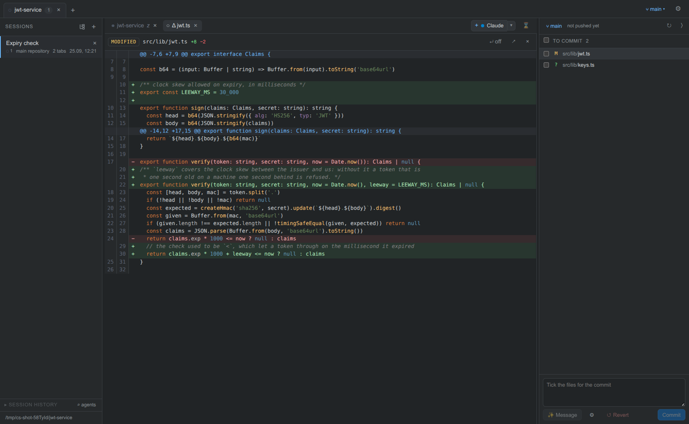

# Claude Studio

Desktop UI for running Claude Code and Codex sessions in parallel: projects in tabs, sessions in isolated git worktrees, diffs and terminals in one window.



## What it does

- **Projects are the top tabs.** Open a local folder or clone a repository; a folder inside a repository binds to its root.
- **Sessions are git worktrees.** A session gets a branch `claude/<slug>` off a chosen base in `<repo>/.worktrees/<slug>`, added to `.git/info/exclude`. Optional: a session can share the project directory.
- **Tabs inside a session.** As many agents, shells, files, diffs and merge views as needed, all in one worktree.
- **A conversation per tab.** Claude gets its own `--session-id`; Codex reports the thread it picked. Two agents in one directory never resume each other.
- **Agents are presets.** Command, arguments (`{session}`, `{name}`), environment, colour and order — editable in the settings; add your own.
- **Statuses and attention.** Working / waiting / idle / asleep, from Claude Code's hooks rather than from a transcript, with a notification and a sound. A tab that cannot report says so.
- **An agent can open a session.** A Claude tab gets one MCP tool, `open_session`: a visible tab with a worktree, a branch and a first task. The agents then talk to each other themselves.
- **Sleeping tabs.** After N idle minutes the process is killed and the id kept; a click resumes the same conversation. Sleep by hand from the tab menu.
- **One history for all agents.** Every Claude and Codex conversation recorded for the project's directories, including those started outside the application.
- **Changes and commits.** Uncommitted files with checkboxes, a diff with highlighting, commit from the panel, a generated commit message, revert to HEAD with a confirmation.
- **Branch work.** Push (`-u` on the first), `gh pr create`, rebase onto the base, merge of the base in, pull with a choice of strategy; conflicts are resolved in a merge tab.
- **Files and editor.** A file tree and CodeMirror 6 with Darcula-style highlighting; saves on a pause, atomically. Paths printed in a terminal are links.
- **Terminals.** xterm.js with WebGL, scrollback replayed on tab switch, search (Ctrl+F), Shift+Enter for a newline in an agent composer.
- **Themes and languages.** Dark and light, English / Ukrainian / Russian, both following the system until chosen. git terms are never translated.
- **State survives.** Projects, sessions and tabs are written to `~/.config/claude-studio/state.json` atomically, with backups and no silent overwrite of a newer version.

## Requirements

- Linux, X11 or Wayland. Developed on Ubuntu 24.04 / KDE Plasma. macOS: the code carries no Linux-only calls and `npm run dist` has dmg/zip targets, but nothing there has ever been run — treat it as untested. No Windows build.
- Node.js 22.5+ (`node:sqlite` reads Codex's index), git, and `gh` for the PR button.
- Claude Code and/or Codex CLI on PATH. The application starts them; it does not bundle them.

## Running

```bash
npm install
npm run rebuild              # node-pty against the Electron ABI
npm run dev                  # development, renderer HMR
npm run build && npm start   # production build
npm run dist                 # AppImage (Linux) or dmg/zip (macOS) in release/
./claude-studio.sh           # build if needed, start in the background, --help for the rest

npm run typecheck            # tsc -b: main and renderer are separate projects
npm run lint                 # eslint: react-hooks and the process boundary
npm test                     # vitest
npm run smoke                # worktrees, pty, IPC, painting — on a throwaway repository
node tools/shot.mjs          # the screenshot above, on a throwaway repository
```

Ubuntu 24.04+ restricts unprivileged user namespaces through AppArmor, so the scripts set `ELECTRON_DISABLE_SANDBOX=1`. An AppArmor profile on the Electron binary is the alternative.

## How it works

```
src/main/       Electron main: window, IPC, git (execFile), node-pty, state, agent hooks and tools
src/preload/    contextBridge → window.api (typed)
src/renderer/   React + xterm.js, diffs, editor, modals
src/shared/     types and channel names, i.e. the IPC contract
```

PTYs live in main and are addressed by `terminalId`; `pty:start` is idempotent, so switching tabs never duplicates output. git is called through one spawn point with a cleaned environment, and every user-supplied path goes through `literal()` at a pathspec position. Main writes no interface copy: a message travels to the renderer as a code and becomes a sentence there.

[docs/architecture.md](docs/architecture.md) — how it works · [docs/decisions.md](docs/decisions.md) — why · [docs/performance.md](docs/performance.md) — measurements · [docs/open-questions.md](docs/open-questions.md) — what is open · [CONTRIBUTING.md](CONTRIBUTING.md) — patches.

## Status

A personal tool, published in case it is useful: 0.1.0, one developer, one Linux desktop, no release binaries yet. The parts that have never run anywhere else — the AppArmor workaround, the Codex index, the node-pty rebuild — are the ones most likely to break for you.

MIT.
